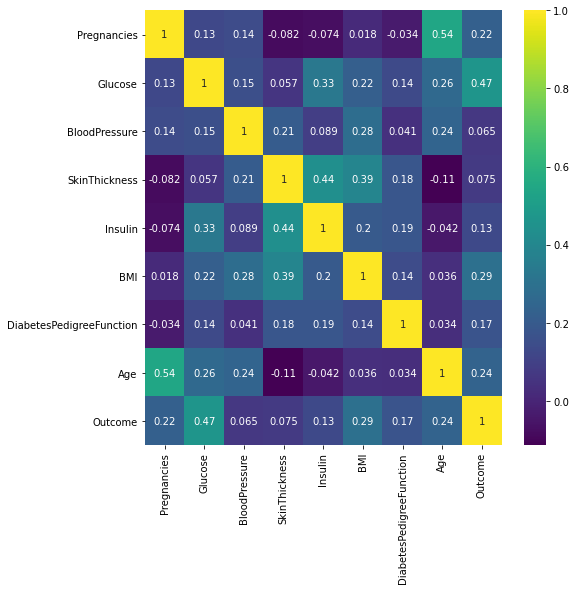
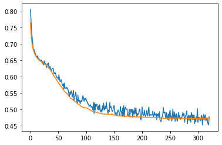
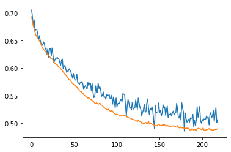
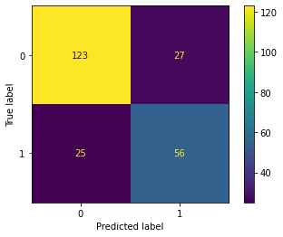

# Diabetes Classifier - Classification with deep learning
- This project is designed to try and classify who has diabetes and who does not given some biological data about patients.
- The dataset used in the project comes from [Kaggle](https://www.kaggle.com/datasets/ashishkumarjayswal/diabetes-dataset?resource=download).
- This project included data exploration and visualisation using several Python libraries such as Seaborn, Matplotlib, Pandas and NumPy.
- Image of the headmap of correlations below.

- Using sklearn I created a logistic regression model which I tested using a train test split. The logistic regression model has an accuracy of **0.79** which is reasonably good given only 8 columns of biological data within the dataset.
- Image of the confusion matrix.

- After looking at the logistic regression model, I then tried to find an improved model using deep learning.
- Using TensorFlow and Keras I was able to make a classification model.
- Image of the loss and val_loss plot.

- This new model ends up having the same accuracy of **0.79**. However, it might be a better model to use in some medical contexts as it is more likely to predict that people have diabetes. Therefore, it could be used as an initial warning for diabetes in patients.
- Image of the confusion matrix.

- If I could spend more time on this project I would try to optimise the model some more. Additionally, I would hope that some different data could be collected that has a correlation with diabetes. As this new data along with more patient data would help to refine the model.
